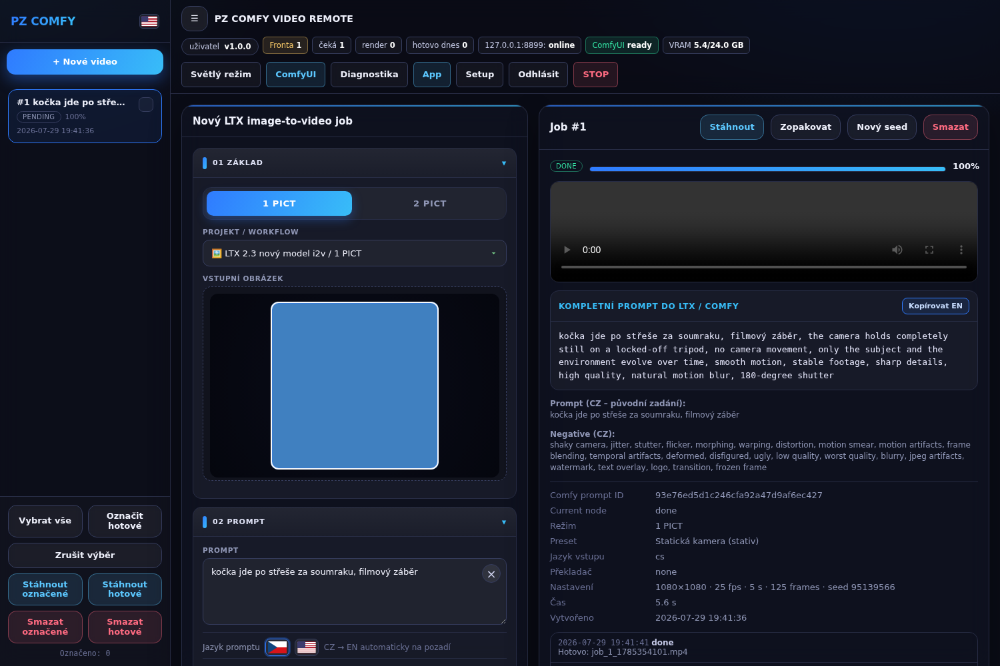

# ComfyLocal



Lokální aplikace nad **ComfyUI běžícím na síti** — fronta jobů, webové UI, LTX 2.3 video
(**1 PICT** z jedné fotky, **2 PICT** z prvního a posledního frejmu) a **photo edit** (Flux.2 / FireRed).

Jeden Python proces, jedna složka, jeden `.bat`. **Žádný hosting, žádný FTP, žádný samostatný worker, žádné tokeny.**

```
┌───────────────────────────┐        HTTPS + WS        ┌────────────────────────────┐
│  ComfyLocal (tvoje PC)    │ ───────────────────────► │  ComfyUI na síti           │
│  webové UI + SQLite fronta│ ◄─────────────────────── │  viz-proxy-dev.nova.group  │
│  + render loop            │   /comfy/api/*, /view    │  /comfy/                   │
└───────────────────────────┘                          └────────────────────────────┘
```

Předchůdce ([COMFY_PC_FTP_WORKER](https://github.com/petroza/COMFY_PC_FTP_WORKER)) měl PHP web na hostingu a Python worker na PC s GPU, které se potkávaly přes REST API a FTP. ComfyUI je teď dostupné přímo na síti, takže to celé spadlo do jedné appky — viz [docs/HANDOVER.md](docs/HANDOVER.md).

## Rychlý start (Windows)

1. Mít **Python 3.10+** (při instalaci zaškrtnout *Add python.exe to PATH*).
2. Rozbalit / naklonovat tuhle složku.
3. Dvojklik na **`START_WINDOWS.bat`**.
   - vytvoří `.venv`, doinstaluje závislosti,
   - z `config.example.json` udělá `config.json`,
   - spustí appku a otevře prohlížeč na `http://127.0.0.1:8770`.
4. V UI zkontrolovat, že chip vlevo nahoře hlásí **ComfyUI online**.

## Rychlý start (Linux)

Na jakékoli distribuci s Python 3.10+:

```bash
./START_LINUX.sh
```

Skript dělá totéž co `START_WINDOWS.bat` — najde Python, vytvoří `.venv`,
doinstaluje závislosti, připraví `config.json` a spustí appku. Závislosti se
přeinstalují jen když se změnil `requirements.txt`.

Ručně (macOS, nebo když chceš mít kontrolu):

```bash
python3 -m venv .venv && . .venv/bin/activate
pip install -r requirements.txt
cp config.example.json config.json
python -m comfylocal
```

## Účty a víc uživatelů

Dokud v databázi není žádný účet, appka jede v původním režimu (volný přístup,
případně PIN). Jakmile vznikne první účet, přihlašuje se jménem a heslem.

**První správce** se založí přes `bootstrap_admin` v `config.json`:

```json
"bootstrap_admin": { "username": "Wolf", "password": "sem-heslo" }
```

Po startu se účet vytvoří a **heslo se z `config.json` hned smaže** (v databázi
zůstane jen PBKDF2 hash). Heslo proto nikdy nepatří do kódu ani do gitu —
`config.json` je v `.gitignore`. Další účty se zakládají v **Admin → Uživatelé**.

Když appku používá víc lidí najednou:

- **Vlastní joby vidí každý celé**, cizí jen anonymizovaně — kdo renderuje
  a kolikátý je ve frontě, ale ne prompt, obrázek ani výsledek.
- **Fronta se střídá** (`fair_queue`), takže dávka 40 obrázků od jednoho
  člověka nezablokuje ostatní. Vypnutím se vrátí striktní pořadí podle vzniku.
- V liště je **odhad času** („hotovo za ~6 min") z průměru posledních
  dokončených renderů. Dokud není z čeho počítat, nezobrazí se nic.
- Zvonek v liště zapíná **upozornění (zvuk + systémová notifikace)**, až render
  dojde — u několikaminutových renderů se u toho nedá sedět.

## Provoz bez internetu

Appka je navržená tak, aby si vystačila s lokální sítí — jediné, s čím mluví, je vaše ComfyUI.

**Překlad promptu** dělá jazykový model, který ve ComfyUI už běží: LTX 2.3 šablona načítá
**Gemma 3 12B Instruct** jako text encoder a ta umí česky. Appka jí pošle malé textové workflow
(`LTXAVTextEncoderLoader` → `TextGenerateLTX2Prompt` → `PreviewAny`) a přečte si výsledek
z historie. Žádný další model se instalovat nemusí.

**Fonty** jsou uložené v `web/fonts/`. Dřív si je CSS tahalo z Google Fonts, takže prohlížeč při
každém otevření appky volal ven — teď se nestahuje nic.

Nastavení v `config.json`:

| Hodnota `translate_backend` | Co dělá |
|---|---|
| `comfy` (výchozí) | Překládá Gemma ve ComfyUI. Bez internetu. |
| `online` | Původní Google / MyMemory. **Vyžaduje internet.** |
| `off` | Nepřekládá se, prompt jde tak, jak ho napíšeš. |

Když překlad přes ComfyUI selže, appka **na internet sama nesáhne** — jen to napíše do chyby jobu.
Záskok po internetu se dá zapnout přes `translate_allow_internet_fallback: true`.

Že to tak doopravdy je, hlídají testy v `tests/test_no_internet.py`: odchytávají `requests`
a hlásí každý cizí host, a navíc kontrolují, že si frontend nikde netahá fonty ani skripty.
V Diagnostice je vidět, který model překládá a že appka internet nepotřebuje.

## Testy

```bash
.venv/bin/python -m pip install -r requirements-dev.txt
.venv/bin/python -m pytest
```

Testy pokrývají hlavně **izolaci jobů mezi uživateli** (v UI se nepozná, ale
rozbité by lidem ukázalo cizí prompty) a **logiku fronty** (střídání uživatelů,
pozice, odhad času). Každý test si dělá vlastní prázdnou databázi.

## Konfigurace (`config.json`)

| Klíč | Význam |
|---|---|
| `comfy_url` | Adresa ComfyUI. Odsud se servírují soubory. Výchozí `https://viz-proxy-dev.nova.group/comfy/`. Fragment `#...` z adresního řádku se **nepíše** — je to jen ID workflow v UI ComfyUI. Dá se přenastavit i v UI: **Setup → Adresa ComfyUI** (uloží se do `config.json` a platí hned). |
| `comfy_api_path` | Předpona API endpointů vůči `comfy_url`, na této proxy `api` → endpointy jsou `…/comfy/api/prompt`, `/queue`, `/history`, `/ws`. Když ComfyUI běží přímo na PC (`http://127.0.0.1:8188`), funguje `api` i `""` — klient si při 404 druhou variantu dohledá sám. |
| `use_system_trust_store` | Výchozí `true`. Python jinak nezná interní firemní CA (prohlížeč ji zná, protože věří úložišti Windows) — tohle mu ji zpřístupní a ověřování zůstane zapnuté. |
| `comfy_ca_bundle` | Cesta k `.pem`/`.crt` s firemní CA, když systémové úložiště nestačí. |
| `comfy_verify_tls` | `false` ověřování vypne. Poslední možnost — appka to napíše do logu a varování urllib3 utiší. |
| `comfy_headers` | Volitelné hlavičky pro proxy (např. Basic auth). |
| `host` / `port` | Kde poslouchá UI. `0.0.0.0` = dostupné i pro kolegy v síti. |
| `access_pin` | Když je vyplněný, UI i API chtějí PIN. Prázdné = bez přihlašování (jen pro důvěryhodnou síť). Účty mají přednost — jakmile existuje aspoň jeden, PIN se přeskočí. |
| `bootstrap_admin` | `{"username": "...", "password": "..."}` — při startu se z toho založí první správcovský účet a heslo se odsud smaže. |
| `fair_queue` | `true` = uživatelé se ve frontě střídají, takže jedna velká dávka neblokuje ostatní. `false` = striktně podle pořadí vzniku. |
| `default_workflow` / `flf2v_workflow` | Které JSONy ze `workflows/` se použijí jako výchozí. |
| `ltx_retry_native_resolution` | Výchozí `true`. Když render spadne na nesouhlasu tenzorů (šablona nesnese zvolené rozlišení), zkusí se ještě jednou v rozlišení, se kterým je šablona vyexportovaná. Do událostí jobu se zapíše, proč je výstup menší. |
| `ltx_align_av_length` | Výchozí `true`. Srovná délku tak, aby audio nebylo delší než obraz (šablona počítá `fps×duration+1`, ale video se dekóduje na nejbližší `8k+1`). Srovnává se dolů, takže velikost video latentu zůstává stejná a obraz vyjde identicky jako předtím — mění se jen délka audia. |
| `ltx_lora_override` | Vymění LoRA ve video šablonách bez editace JSONu (např. `"ltx-2.3-22b-distilled-1.1.safetensors"`), `"off"` ji vypne. Hodí se, když je LoRA ze šablony na serveru poškozená nebo chybí. |
| `defaults` | Předvyplnění formuláře (fps, délka, rozlišení, Prompt Enhance…). |
| `purge_finished_after_hours` | Automatický úklid hotových jobů. `0` = nikdy. |

Vše jde přepsat i proměnnou prostředí: `COMFY_URL`, `COMFYLOCAL_PORT`, `COMFYLOCAL_HOST`, `COMFYLOCAL_PIN`, `COMFYLOCAL_VERIFY_TLS`, `COMFYLOCAL_OPEN_BROWSER`.

## Co appka umí

Frontend je přenesený z původního webu (`app.php`) 1:1 — levý sidebar s frontou a hromadnými nástroji,
akordeon **01 Základ … 06 Odeslání**, pravý panel **Detail jobu**, přepínač CZ/EN, světlý/tmavý režim.

- **1 obrázek → video** (LTX 2.3 i2v), **2 obrázky → video** (první + poslední frejm / FLF2V), **photo edit** (Flux.2 / FireRed).
- Dávkový upload až 40 obrázků = 40 jobů se stejným nastavením; seed režimy `zamčený` / `+1 v dávce` / `náhodný`.
- Presety pohybu kamery a stylu (texty jdou přepsat ručně), formáty rozlišení, seed, délka, FPS a Prompt Enhance.
- Posuvníky **Kroky výpočtu** a **Držení promptu (CFG)** se ukazují jen u photo edit — tam ty hodnoty opravdu
  něco řídí. U LTX 2.3 se schovají a nepatchují: šablona má pevný rozpis sigem (`ManualSigmas`) a `cfg = 1`,
  a přepisovat je hodnotou z formuláře dělalo z videa šum.
- Fronta s živým průběhem přímo z ComfyUI (WebSocket, fallback na polling), zrušení, rerun, editace pending jobu, změna vstupní fotky, mazání, hromadné akce a stažení výsledků.
- Automatický překlad promptu CZ→EN na pozadí — **jazykovým modelem, který už běží ve ComfyUI**,
  takže appka nepotřebuje výstup do internetu (viz *Provoz bez internetu*). Když překlad nevyjde,
  prompt se pošle v původním jazyce a nic se nezablokuje.
- **Diagnostika** v UI: dostupnost ComfyUI, API i file báze, WebSocket, GPU/VRAM, modely z `object_info`,
  workflow šablony, složky, DB a překladač.
- **Setup** v UI: adresa ComfyUI, předpona API, TLS a timeout — s tlačítkem *Vyzkoušet spojení*.
- Přehrání výsledku (video i obrázek) rovnou v UI; výstupy leží v `data/outputs/`.
- Zachované ochrany z původního workeru: LTX image-hold (`320:288` / `320:296`), autofix názvů modelů podle `object_info`, kontrola, že se nahraný obrázek opravdu dostal do workflow.

## Struktura

| Cesta | K čemu je |
|---|---|
| `comfylocal/config.py` | Konfigurace, cesty, odvození API a WS adres |
| `comfylocal/comfy_client.py` | HTTP/WS klient ComfyUI (upload, prompt, queue, history, /view) |
| `comfylocal/workflow.py` | Sestavení a patchování API workflow (LTX 2.3 i2v + FLF2V, photo edit) |
| `comfylocal/logging_setup.py` | Logování do konzole a do `data/logs/comfylocal.log` (s rotací) |
| `comfylocal/db.py` | SQLite fronta jobů |
| `comfylocal/runner.py` | Render loop ve vlákně — bere joby a hlídá průběh |
| `comfylocal/compat.py` | API kompatibilní s `api.php` (aby fungoval přenesený frontend) |
| `comfylocal/server.py` | Servírování UI, stránka Setup, uložení adresy ComfyUI |
| `comfylocal/projects.py` | Projekty = workflow šablony ze složky `workflows/` |
| `comfylocal/translate.py` | Volba překladače (`comfy` / `online` / `off`) + záložní online překlad |
| `comfylocal/translate_comfy.py` | Překlad jazykovým modelem ve ComfyUI — bez internetu |
| `comfylocal/__main__.py` | `python -m comfylocal` |
| `web/` | UI (HTML/CSS/JS, bez frameworků) |
| `workflows/` | ComfyUI **API** workflow šablony (i2v, FLF2V, photo edit) |
| `docs/comfyui_projects/` | Zdrojové projekty z ComfyUI (formát UI), ze kterých jsou šablony vyexportované |
| `data/` | Uploady, výstupy, DB, temp (v gitu není) |

## Workflow šablony

Ve `workflows/` jsou tyhle šablony:

| Soubor | Režim | Model |
|---|---|---|
| `ltx23_i2v_template.json` | 1 PICT — video z jedné fotky | `ltx-2.3-22b-dev-fp8` + distilled LoRA |
| `ltx23_flf2v_template.json` | 2 PICT — první + poslední frejm | `ltx-2.3-22b-distilled-fp8` |
| `flux2_edit_template.json` | photo edit — fotka dovnitř, fotka ven | Flux.2 |
| `firered_edit_template.json` | photo edit — fotka dovnitř, fotka ven | FireRed / Qwen |

Appka zná i tyhle novější modely. Šablony k nim v repu **nejsou** — je potřeba je jednou
naimportovat (viz níž), protože z ComfyUI přišly jako UI export, ne jako API:

| Soubor | Režim | Model |
|---|---|---|
| `ltx25_i2v_template.json` | 1 PICT — video z jedné fotky | LTX 2.5 distilled + Gemma 4 12B |
| `ltx25_flf2v_template.json` | 2 PICT — první + poslední frejm | LTX 2.5 distilled |
| `minimax_h3_i2v_template.json` | 1 PICT — video z jedné fotky | MiniMax H3 `fl2va` + Qwen3-VL 32B |
| `minimax_h3_ref2v_template.json` | 2 PICT — obě fotky jako **reference** | MiniMax H3 `ref2va` |

U MiniMax H3 „podle referencí" nejde o první a poslední frejm: obě fotky jsou reference a
v promptu se na ně odkazuje jako `<Picture 1>` a `<Picture 2>`.

### Import workflow z ComfyUI

Workflow lze spravovat také bez příkazové řádky na stránce **Admin → Projekty / workflow**:

* nahrát nový JSON z **Workflow → Export (API)**,
* workflow zapnout nebo vypnout,
* odebrat ho se zachováním obnovitelné kopie ve `workflows/_removed/`,
* zkontrolovat všechny checkpointy, text encodery, VAE a LoRA, které používá, včetně chybějících souborů.

Velké soubory modelů (`.safetensors`, `.gguf` apod.) se touto stránkou nemažou. Spravují se přímo
v instalaci ComfyUI; Admin bezpečně spravuje jen aplikační workflow a ukazuje jejich závislosti.

ComfyUI umí workflow uložit dvěma způsoby a **appka umí jen ten druhý**:

* *Workflow → Export* — podklad pro editor (`nodes`, `links`, `definitions.subgraphs`).
* *Workflow → Export (API)* — plochý `{id: {class_type, inputs}}`, tohle se posílá na `/prompt`.

Nejspolehlivější je proto v ComfyUI dát **Export (API)** a soubor jen zkopírovat do `workflows/`.

Když máš jen obyčejný export (třeba ty v `docs/comfyui_projects/`), převede ho tenhle příkaz:

```bash
python -m comfylocal import-workflow docs/comfyui_projects/video_ltx2_5_i2v.json
```

Import si vyžádá seznam nodů ze **živého ComfyUI** (`object_info`), protože v UI exportu jsou
hodnoty parametrů uložené jako pole **bez jmen** — a ta se nesmí hádat, špatně přiřazený parametr
znamená spadlý nebo tiše špatný render. Zvládne i rozbalení subgrafů (u LTX 2.5 je v subgrafu celý
pipeline). Když si jménem nějakého parametru není jistý, **nic nezapíše** a napíše, co mu chybí.
Na konci vypíše modely, které workflow potřebuje, a označí ty, které na ComfyUI nejsou.

Obě LTX šablony jsou export ve formátu **API** (*Workflow → Export (API)*) z projektů, které leží
v `docs/comfyui_projects/`. Když se projekt v ComfyUI změní, stačí ho znovu vyexportovat do API
a přepsat příslušný soubor ve `workflows/`. Režim si appka pozná sama: `SaveImage` bez video nodů
= photo edit, dva `LoadImage` = 2 PICT, jinak 1 PICT. Projekt uložený ve formátu UI (ten velký JSON
s `nodes`) do `workflows/` **nepatří** — ComfyUI ho přes `/prompt` nepřijme a appka na to upozorní.

Z UI se patchuje prompt, negative, vstupní obrázky, rozlišení, FPS, délka, seed a Prompt Enhance —
podle titulků nodů a placeholderů (`__POSITIVE_PROMPT__`, `__IMAGE_FILENAME__`, `__SEED__`, …).
Kroky výpočtu a `cfg` se patchují **jen u photo edit**. U LTX se na `cfg`, `sampler_name`, sigmy ani
na `strength` vodicích obrázků nesahá, aby render dopadl stejně jako v ComfyUI.

### Rozlišení u LTX

LTX 2.3 komprimuje obraz 32×, a i2v šablona navíc počítá první průchod v polovičním rozlišení
a pak ho zvedá 2× spatial upscalerem. Výsledek je tedy `2 × ((rozměr / 2) // 32) × 32` — aby se
rovnal zadání, musí být rozměr **násobek 64**. Násobek 32 nestačí: 720 projde (720 // 32 = 22, sudé),
ale ComfyUI z něj stejně udělá 704 (720/2 = 360, 360 // 32 = 11 → 352, ×2 = 704).

Appka proto u video režimů rozměry srovná na násobek 64 (`ltx_safe_size`) — v UI i na backendu —
takže **to, co je v UI, je i ve výsledném souboru**. Většina presetů je násobek 64 a nemění se
(1920, 1088, 1472, 1280, 1024, 1984); 1080 se posune na 1088 a HD presety hlásí 1280×704 / 704×1280,
protože to je to, co LTX doopravdy vyrobí. Photo edit tuhle větev nemá, tam se rozměry nechávají.

### Délka a audio

Šablona počítá délku jako `fps × duration + 1` (u 25 fps a 5 s = 126), jenže video VAE stlačuje
čas 8× a dekóduje zpátky jen `(T-1)×8+1` frejmů — reálně tedy 121. Audio ale dostávalo 126, takže
přečnívalo o ~0,2 s. `ltx_align_av_length` proto délku srovná dolů na nejbližší `8k+1` a nastaví ji
oběma najednou. Video se tím nemění: `T = (frames-1)//8 + 1` vyjde pro 126 i 121 stejně (16).

### Když render spadne na nesouhlasu tenzorů

Hláška `The size of tensor a (X) must match the size of tensor b (Y)` má dvě různé příčiny a appka
je od sebe odliší. Když platí `Y = 128 × (X + počet audio latentů)`, jde o **známou chybu ComfyUI**
(issue [#13692](https://github.com/Comfy-Org/ComfyUI/issues/13692) a
[#13887](https://github.com/Comfy-Org/ComfyUI/issues/13887)): šum se vyrobí jen pro video, ale latent
obsahuje i audio. To se v appce nastavit nedá — **řeší to aktualizace ComfyUI na serveru**. Appka
tuhle signaturu sama pozná a napíše to do chyby jobu. Do logu se navíc u každého jobu zapíše
předpočítaná geometrie (`LTX geometrie: …`), takže se dá ověřit, jestli čísla z chyby odpovídají
rozlišení, nebo ne.

## Log

Appka píše log do konzole **a** do `data/logs/comfylocal.log`. Na Windows běží v okně
`START_WINDOWS.bat`, které se po pádu hned zavře — bez souboru by chyba nešla dohledat.

- Soubor rotuje po 5 MB a drží 5 starších kusů, takže neroste do nekonečna.
- Ve **stránce Setup** je panel *Log*: tlačítko **Načíst konec logu** ukáže posledních 400 řádků
  přímo v prohlížeči, **Stáhnout log** ho pošle jako soubor (hodí se k nahlášení chyby).
- Nastavení v `config.json`: `log_to_file`, `log_level` (`DEBUG` / `INFO` / `WARNING`),
  `log_max_bytes`, `log_backup_count`.

V logu je u každého jobu vidět celý patch workflow (co se do šablony přepsalo a z čeho na co),
takže když render dopadne jinak, než čekáš, je to první místo, kam se podívat.

## Nasazení v kontejneru (server, firemní přihlášení)

Když má appka běžet centrálně, ať si nikdo nic neinstaluje:

```bash
COMFY_URL="https://viz-proxy-dev.nova.group/comfy/" docker compose up -d --build
```

- Appka nepotřebuje GPU — jen mluví na ComfyUI po síti.
- Fronta, uploady a výstupy jsou ve volume `comfylocal-data`; bez něj se po redeploy ztratí.
- `workflows/` je přimountovaná read-only, takže nová šablona nevyžaduje rebuild.

**Přihlašování.** ComfyLocal nemá uživatelské účty a mít je nebude — na to je před ním
reverse proxy s firemním SSO (stejně jako u ComfyUI samotného). Doporučené nastavení:

1. V compose změň publikovaný port na `127.0.0.1:8770:8770`, aby appka nebyla vidět přímo ze sítě.
2. Před ni postav proxy, která vyžádá přihlášení a teprve pak předá požadavek na `127.0.0.1:8770`.
3. `COMFYLOCAL_PIN` nech prázdný — dvojí přihlašování jen zdržuje. Kdo appku vystaví bez proxy, PIN si zapne.

Oprávnění po skupinách/uživatelích se pak řeší v proxy, ne v appce. Jediné, co appka o přihlášení
potřebuje vědět, je opačný směr: pokud je **ComfyUI** za autentizací, přihlašovací hlavičku
(cookie / Basic auth) jí předáš přes `comfy_headers` v `config.json`.

**WebSocket.** Samotné UI appky WebSocket nepotřebuje — frontend se ptá přes `/api.php`.
Zato proxy **před ComfyUI** by měla `Upgrade` propouštět: bez WS se průběh renderu jen
dopočítává pollingem, což funguje, ale progress je hrubší.

## Když chip hlásí „ComfyUI offline"

Appka řekne důvod, ne jen stav. Podrž myš nad chipem, nebo otevři **Diagnostiku** —
vypíše se sonda na `/system_stats`, `/queue` a `/object_info`, k tomu druhá báze (s/bez `/api`)
a konkrétní příčina:

| Co Diagnostika napíše | Co to znamená |
|---|---|
| `HTTP 404 — proxy tuhle cestu nesměruje` | špatná adresa nebo předpona API; když druhá báze projde, Setup ti to napoví |
| `HTTP 200, ale odpověď není JSON` | vrací se přihlašovací stránka nebo UI, ne API — proxy chce SSO |
| `Proxy odpovídá přesměrováním 302 na …` | totéž, jen jinou cestou |
| `HTTP 401 / 403 — proxy chce autentizaci` | doplň hlavičku do `comfy_headers` |
| `TLS certifikát neprošel ověřením` | interní certifikát: nech `use_system_trust_store` zapnuté (Python pak věří tomu samému co prohlížeč), nebo dej `comfy_ca_bundle`; teprve pak vypni ověřování |
| `Jméno serveru se nepřeložilo (DNS)` | nejsi na firemní síti / VPN |
| `Spojení jde přes HTTP proxy a ta ho odmítla` | interní adresu přidej do `NO_PROXY` |

Do `comfy_url` patří `…/comfy/` **s** lomítkem, do předpony API `api` (tedy endpointy
`…/comfy/api/...` bez koncového lomítka) — přesně jak to routuje viz-proxy-dev.

## Když render spadne v ComfyUI

Chybu z ComfyUI appka nepřepisuje, jen k ní přidá vodítko. Nejčastější případy:

| Hláška | Co s tím |
|---|---|
| `shape '[…]' is invalid for input of size …` na `LoraLoaderModelOnly` | soubor LoRA je poškozený/nedotažený nebo patří k jinému modelu — nahraj ho v ComfyUI znovu, případně dej `strength_model` na 0 a ověř, že render projde bez ní |
| `size mismatch` | checkpoint, LoRA a text encoder ve workflow nepatří k sobě |
| `ModelMMAP … get_file_handle` | restartuj ComfyUI s `--disable-dynamic-vram --disable-mmap` |
| `The size of tensor a (…) must match the size of tensor b (…)` | šablona nesnese zvolené rozlišení. Appka nejdřív sladí vodicí obrázek s latentem, a když to nepomůže, zopakuje render v nativním rozlišení šablony a napíše to do událostí jobu |
| `No space left on device` v logu ComfyUI | na serveru není místo. Modely se dotahují jen částečně a pak hlásí poškozené tenzory — uvolnit místo a dotčené modely nahrát znovu |

Diagnostika navíc u každé šablony ověří, že **modely a LoRA, na které odkazuje, ComfyUI opravdu nabízí**.
Když chybí, napíše který a co je místo něj k dispozici. Pozor na rozdíl: chybějící soubor pozná
Diagnostika, ale **poškozený soubor projde** a spadne až při renderu.

**Rozlišení vs. vodicí obrázek.** LTX 2.3 šablona vede vstupní fotku přes `ResizeImagesByLongerEdge`
s pevným limitem 1536 px, ale latent se staví z Width/Height z formuláře. Při FHD (1920×1080) se tak
vodicí obrázek zmenšil na 1536×864, latent zůstal 1920×1080 a sampler spadl. Appka proto ten limit
sama zvedne na delší stranu požadovaného rozlišení — u menších rozlišení se nic nemění.

Když si nejsi jistý, jestli je chyba v appce nebo v samotném workflow, spusť stejnou šablonu
přímo v ComfyUI. Když spadne i tam, ComfyLocal s tím nemá co dělat.

## Poznámky k síti a bezpečnosti

- Appka je určená do interní sítě. Nemá HTTPS ani uživatelské účty — jen volitelný PIN.
- Nesahá na ComfyUI jinak než přes jeho vlastní HTTP API; nic nespouští ani nerestartuje.
- V repu nejsou žádné adresy s tokeny, hesla ani data — `config.json` a `data/` jsou v `.gitignore`.

## Licence

MIT pro aplikační obal. ComfyUI, LTX, Flux a modely třetích stran mají vlastní licence.
